<div align="center">

# Verity

**An evaluated, observable RAG agent for enterprise documents.**
Retrieves, reasons over multiple steps, cites exact passages, and *refuses to answer
when the evidence is weak* — instead of hallucinating. Every answer is measured.

[](https://github.com/matteogallo-ai/verity/actions/workflows/ci.yml)
[](LICENSE)


</div>

> **v1.0.0 — measured on `claude-sonnet-4-6` (agent + judge), one live run of record.**
> Every chiffre in the table below is copied verbatim from
> [`scorecards/live-v1.0.0.json`](scorecards/live-v1.0.0.json) (schema
> `verity.scorecard.headline/v2`), backed by the full per-example audit trail at
> [`datasets/eval/runs/live/eval_d0ca1d5_questions.json`](datasets/eval/runs/live/eval_d0ca1d5_questions.json).
> No hand-typed numbers. No averaged runs. No re-shot chiffre. See
> [Constats ouverts](#constats-ouverts--what-the-numbers-do-not-say) for what
> the numbers do not say.

## Measured results

<!-- RESULTS:START -->
**Measured on**: `agent=claude-sonnet-4-6 (16/16)` · `judge=claude-sonnet-4-6 (12/12)` · `embedding=BAAI/bge-small-en-v1.5` · commit `d0ca1d5` · 2026-09-07 · n=16 (11 answerable + 5 out-of-scope) · total cost **$0.2713**

| Metric | Value | Notes |
|---|---:|---|
| **Refusal recall** | **0.800** | headline · fraction of out-of-scope questions correctly refused |
| **Refusal precision** | **1.000** | of the refusals, fraction that were genuinely unanswerable |
| Faithfulness | 1.000 | claim-level, judge=`claude-sonnet-4-6 (12/12)` |
| Citation accuracy | 0.792 | judge=`claude-sonnet-4-6 (12/12)` |
| Hallucination rate (answerable only) | 0.000 | ↓ better · gated on `example.answerable` |
| Out-of-scope answered | 1/5 | ↓ better · questions we shipped an answer for that were unanswerable |
| Retrieval nDCG@8 | 0.953 | deterministic (no LLM) |
| Retrieval recall@8 | 1.000 | deterministic |
| Retrieval precision@8 | 0.148 | k>gold ceiling; interpret with recall |
| Latency p50 / p95 / p99 | 9374.7 ms / 32526.5 ms / 36653.1 ms | warm; cold_start `n/a` (isolated) |
| Cost / query | $0.0122 | total $0.2713 = agent $0.1950 + judge $0.0763 |

Numbers are copied verbatim from [`scorecards/live-v1.0.0.json`](scorecards/live-v1.0.0.json) (committed artefact of the single live run of record — never averaged, never re-run to nudge a number).

<!-- RESULTS:END -->

Provenance : every value above is copied verbatim from the committed
scorecard JSON by [`scripts/generate_headline_results.py`](scripts/generate_headline_results.py)
— hand-typed numbers are impossible (`--check` mode fails CI if the README
would drift). Methodology (how refusal is scored, why the dataset contains
unanswerable + near-miss questions) : [`docs/evaluation-methodology.md`](docs/evaluation-methodology.md).

## Constats ouverts — what the numbers do not say

Honest limitations of this v1.0.0 run of record. Each one is empirical, not
speculative, and points at the specific artefact that backs it.

- **`citation_accuracy = 0.792` — granularity, not hallucination.** The 13
  claims with `citation_ok=false` (across q-001, q-002, q-003, q-007, q-013)
  are all `supported=true` : the LLM judge marked them as insufficiently
  cited because Sonnet compresses several facts into a paragraph and cites
  the top-level sentence, so sub-claims inherit a paragraph-level citation.
  The synthesizer's verbatim-quote invariant holds ; the judge is applying
  a stricter claim-atomic-↔-quote correspondence. **Measured granularity
  gap, not fabrication.** Per-question breakdown in
  [`datasets/eval/runs/live/…json[per_audit]`](datasets/eval/runs/live/eval_d0ca1d5_questions.json).
- **q-015 exposes a dataset labelling ambiguity.** The question *"Which
  specific cloud provider hosts the production infrastructure?"* is labelled
  out-of-scope (the corpus does not name a provider), but admits a sourced
  non-answer : the DPA states *"Provider engages a cloud infrastructure
  provider and a transactional email provider as sub-processors"* without
  naming them. The agent shipped a cited *"the evidence does not specify
  which particular cloud provider…"* answer with `confidence=0.99`,
  grounded in one citation and judged 3/3 supported. Under strict
  confusion-matrix convention this counts as **FN (didn't refuse
  out-of-scope)** — the label only checks the boolean `refused`, not the
  content. **`refusal_recall = 0.800` is reported as-is.** The dataset
  label is preserved so the metric stays reproducible run-to-run.
- **16 questions / 5 documents = a method proof, not a scale benchmark.**
  The sparse arm (BM25) is weak on this corpus ; hybrid retrieval is carried
  by dense + cross-encoder rerank. `precision@k = 0.148` is capped by
  construction (each question has 1–2 gold chunks, `k=8` → theoretical
  maximum ≈ 0.25). Interpret alongside `recall@8 = 1.000` and
  `nDCG@8 = 0.953`. A v1.1 with a wider corpus is the next step, not a fix.
- **One measured run, no averaging, no warmup.** Latency percentiles
  (`p50 = 9.4 s`, `p95 = 32.5 s`, `p99 = 36.7 s`) include the first-question
  cold-start bias (`--no-warmup` was chosen to avoid paying for a throwaway
  agent call). LLM latency dominates the local-model cold-start ; the p99 is
  a real observation from one run, not a p99 over 100 runs.

## The problem

Enterprise RAG demos answer confidently and are wrong just often enough to be dangerous.
The failure that matters is not "retrieval is imperfect" — it is **a fluent answer with
no grounding and no signal that it is unreliable**. For documents that drive real
decisions (contracts, filings, policies), a system that *knows when it doesn't know* is
worth more than one that always answers.

Verity treats that as an engineering problem, not a prompt trick : measure grounding,
measure refusal calibration, make both visible, gate them in CI, and preserve every
per-answer audit record so numbers can be traced back to the exact answer + judge
verdict that produced them.

## Architecture

```mermaid
flowchart LR
    subgraph Ingest["Ingestion (S1)"]
        docs[/"docs<br/>PDF · DOCX · MD · web"/] --> parser[docling parser<br/>structure-aware]
        parser --> chunker[semantic chunker]
        chunker --> embedder[BAAI/bge-small-en-v1.5]
    end

    embedder --> store[(pgvector<br/>+ FTS index)]

    subgraph Retrieve["Hybrid retrieval (S2)"]
        query[/"query"/] --> dense[dense search<br/>pgvector]
        query --> sparse[sparse search<br/>BM25 / FTS]
        dense --> rrf[RRF fusion]
        sparse --> rrf
        rrf --> rerank[cross-encoder<br/>ms-marco-MiniLM]
    end

    store --> dense
    store --> sparse

    subgraph Agent["Agentic RAG (S3)"]
        rerank --> decompose[decompose]
        decompose --> synthesize[synthesize<br/>+ verbatim citations]
        synthesize --> score[confidence scorer]
        score -->|below threshold| refuse[REFUSE<br/>with rationale]
        score -->|above| ship[Answer + citations]
    end

    subgraph Eval["Eval harness (S4-S7)"]
        ship --> judge[LLM judge<br/>faithfulness · citation_ok]
        refuse --> refusal[refusal calibration<br/>TP/FP/FN/TN]
        judge --> scorecard["scorecards/live-v1.0.0.json<br/>+ per_audit trail"]
        refusal --> scorecard
    end

    scorecard --> readme["README results table<br/>(generated, verbatim)"]
```



## Stack

Python 3.13 · FastAPI · pgvector (single stateful service : vectors + FTS + eval
history) · local embeddings + cross-encoder reranker (offline, no keys) · multi-provider
LLM runtime (`anthropic>=1.0,<2.0` / `openai>=3.0,<4.0` / local) with
authentication-aware fallback and per-request provenance stamping · OpenTelemetry +
structlog · Next.js 15 UI. Tooling : uv · ruff · mypy strict · pytest · GitHub Actions.

## Engineering discipline

The v1.0.0 numbers are not a snapshot ; they are the output of a pipeline that
enforces its own invariants. Concrete guarantees, each backed by a test :

- **Live artefacts are write-protected.** The `resolve_runs_dir` rule routes
  any run whose agent OR judge is a real LLM into a dedicated `live/`
  subdirectory. Stub runs (CI, `verity eval run --ci`, generator `--check`)
  physically cannot touch that subtree — the 4-combo truth table is
  pinned by `test_stub_live_path_separation.py`. Belt-and-braces on top :
  `StubOverwritesLiveError` / `StubOverwritesLiveScorecardError` raise
  exit 5 if any code path tries to overwrite a live artefact from a
  stub-provenance run. Bypass requires explicit `allow_overwrite=True` —
  no accidental clobber.
- **Every published metric is traceable.** `PerExampleAudit` (16 records
  per run, one per dataset example) preserves the question, answer text,
  citations, hits used, and per-claim judge verdict. Aggregate
  `citation_accuracy = 0.792` reconciles bit-exact with a fresh recompute
  from `per_audit` — no fabricated numbers, no soft rollups. Contract
  locked by `test_audit_persistence.py`.
- **Prompt schemas are shown, not implied.** Every LLM-JSON prompt renders
  its output schema explicitly in the user message. A regression to
  schema-in-a-`#`-comment cannot happen : parser tolerance in
  `verity.agent.scorer` / `verity.eval.judge` accepts documented aliases,
  and 23 real-Sonnet-shape tests in `test_llm_output_parsers.py` exercise
  every drift class observed in the wild.
- **SDK signatures are verified per-call-site.** For every LLM call point
  (decompose, synthesize, confidence scorer, judge), a smoke test
  (`test_llm_sdk_schema.py`) binds the kwargs to the real pinned SDK
  signature — a future dependency bump that renames or drops a kwarg fails
  CI, not the next live spend.
- **README vocabulary has one source.** Every metric label in the CLI
  console output must match a key in the v2 JSON scorecard. Locked by
  `test_label_source_of_truth.py` : no console-only vocabulary, no
  JSON-only vocabulary.
- **Per-request provenance, not boot config.** `Answer.provider_used`
  reflects the LLM that actually served the request, including any router
  fallback. The headline scorecard's `agent_model` / `judge_model`
  strings are aggregated from per-answer stamps
  (e.g. `"claude-sonnet-4-6 (16/16)"` or a split when a fallback fires).

## Quickstart

```bash
git clone https://github.com/matteogallo-ai/verity && cd verity
cp .env.example .env                       # keys optional — retrieval + eval run offline
docker compose up -d db                    # pgvector
uv sync --dev                              # ~2 GB (torch + docling) on first sync
uv run verity db upgrade                   # apply migrations
uv run verity ingest datasets/corpus       # parse → chunk → embed → upsert
uv run verity eval run --ci                # deterministic stub eval — writes datasets/eval/runs/
```

The first ingestion run downloads the default embedding model
(`BAAI/bge-small-en-v1.5`, ~130 MB) into the Hugging Face cache — subsequent runs are
fully offline.

To reproduce the v1.0.0 headline (spends $0.27) :

```bash
export VERITY_ANTHROPIC_API_KEY=sk-ant-...
uv run verity eval run \
  --judge live --no-agent-stub --no-warmup \
  --dataset datasets/eval/questions.jsonl \
  --scorecard-json scorecards/live-v1.0.0.json \
  --budget-usd 8.0 --report-only-floors \
  --floor-refusal-recall 0.6 --floor-ndcg 0.5 --floor-recall 0.75
```

Persists to `datasets/eval/runs/live/eval_<sha>_questions.json` (write-protected
audit tree) + refreshes the scorecard. `python scripts/generate_headline_results.py`
regenerates the README block from the JSON.

## Demo

Silent-captioned, ~90 seconds, script at [`docs/demo-script.md`](docs/demo-script.md) :
upload a PDF → cited answer (click a citation, source pane highlights the
exact clause) → out-of-scope question → calibrated refusal with a concrete
rationale → terminal shows the audit trail. No GIF is committed unless it
was recorded from a real session — no re-shoot to nudge a chiffre.

## UI

Next.js 15 + TypeScript strict, in [`web/`](web/). Zero-key demo path :

```bash
make demo          # FastAPI (stub) on :8000 + Next dev on :3000, both offline
```

Upload → cited answer with inline citations that highlight the source chunk on
click, honest source panel (rerank score + cited/not-cited flag per chunk),
first-class refusal state, and a persistent provenance badge on every answer
(`stub-agent` for the demo, `<model>` in live mode). See
[`web/README.md`](web/README.md) for the honesty guarantees.

## Development

```bash
uv run ruff check . && uv run ruff format --check .
uv run mypy
uv run pytest -m "not integration"
uv run python scripts/generate_headline_results.py --check   # README ≡ scorecard
```

See [CONTRIBUTING.md](CONTRIBUTING.md). Licensed under [MIT](LICENSE).
